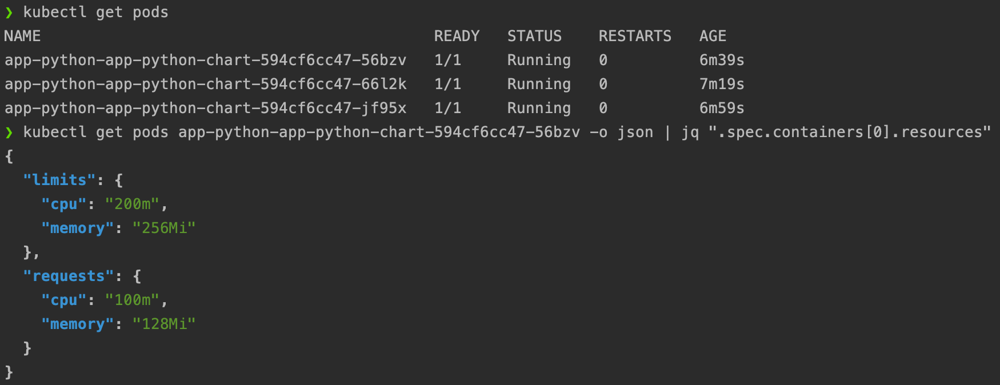

# Lab 11. Secrets management & resource control

## Secrets

### Creation and decoding of a secret using `kubectl`

- Text version:

  ```bash
  ❯ echo -n "1mp0rt@nt_3ecret" > password.txt

  ❯ kubectl create secret generic user-pass \
    --from-file=password=./password.txt
  secret/user-pass created

  ❯ kubectl get secrets
  NAME                                     TYPE                                  DATA   AGE
  app-python-chart-token-ljr8s             kubernetes.io/service-account-token   3      5d
  default-token-mpp52                      kubernetes.io/service-account-token   3      9d
  sh.helm.release.v1.app-python-chart.v1   helm.sh/release.v1                    1      5d
  user-pass                                Opaque                                1      5s

  ❯ kubectl describe secrets/user-pass
  Name:         user-pass
  Namespace:    default
  Labels:       <none>
  Annotations:  <none>

  Type:  Opaque

  Data
  ====
  password:  16 bytes

  ❯ kubectl get secret user-pass -o jsonpath='{.data.password}' | base64 -d
  1mp0rt@nt_3ecret%    
  ```

- Image version: 

**Note:** `%` in the output represents null byte

### Secrets using `helm`

- Text version:

  ```bash
  ❯ helm secrets upgrade app-python ./app-python-chart -f ./app-python-chart/secrets.yaml
  Release "app-python" has been upgraded. Happy Helming!
  NAME: app-python
  LAST DEPLOYED: Sat Sep 25 14:38:17 2021
  NAMESPACE: default
  STATUS: deployed
  REVISION: 3
  NOTES:
  1. Get the application URL by running these commands:
       NOTE: It may take a few minutes for the LoadBalancer IP to be available.
             You can watch the status of by running 'kubectl get --namespace default svc -w app-python-app-python-chart'
    export SERVICE_IP=$(kubectl get svc --namespace default app-python-app-python-chart --template "{{ range (index .status.loadBalancer.ingress 0) }}{{.}}{{ end }}")
    echo http://$SERVICE_IP:8000
  ./app-python-chart/secrets.yaml.dec

  ❯ kubectl get po
  NAME                                           READY   STATUS    RESTARTS   AGE
  app-python-app-python-chart-6f7c9968dc-c77rf   1/1     Running   0          8m33s
  app-python-app-python-chart-6f7c9968dc-dtvm5   1/1     Running   0          8m33s
  app-python-app-python-chart-6f7c9968dc-hctwf   1/1     Running   0          8m33s

  ❯ kubectl exec app-python-app-python-chart-6f7c9968dc-hctwf -- printenv | grep MY_PASSWORD
  MY_PASSWORD=1mp0rt@nt_3ecret
  ```

- Image version: 

## Resource control

An existent template allows for resource control, so I just modify [values.yaml](./app-python-chart/values.yaml)
to include limits:

```yaml
resources:
  # 1 cpu == 1000m cpu
   limits:
     cpu: 200m
     memory: 256Mi
   requests:
     cpu: 100m
     memory: 128Mi
```

Applying the chart we can see that new pods have limits:

