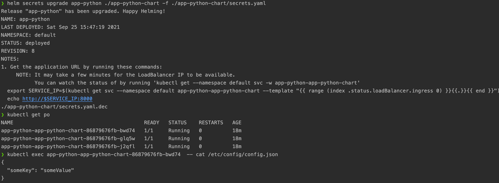

## Helm ConfigMap

Configs are taken from [files/configs](./app-python-chart/files/configs) folder of the template

- Text version:

  ```bash
  ❯ helm secrets upgrade app-python ./app-python-chart -f ./app-python-chart/secrets.yaml
  Release "app-python" has been upgraded. Happy Helming!
  NAME: app-python
  LAST DEPLOYED: Sat Sep 25 15:47:19 2021
  NAMESPACE: default
  STATUS: deployed
  REVISION: 8
  NOTES:
  1. Get the application URL by running these commands:
       NOTE: It may take a few minutes for the LoadBalancer IP to be available.
             You can watch the status of by running 'kubectl get --namespace default svc -w app-python-app-python-chart'
    export SERVICE_IP=$(kubectl get svc --namespace default app-python-app-python-chart --template "{{ range (index .status.loadBalancer.ingress 0) }}{{.}}{{ end }}")
    echo http://$SERVICE_IP:8000
  ./app-python-chart/secrets.yaml.dec

  ❯ kubectl get po
  NAME                                           READY   STATUS    RESTARTS   AGE
  app-python-app-python-chart-86879676fb-bwd74   1/1     Running   0          18m
  app-python-app-python-chart-86879676fb-glq5w   1/1     Running   0          18m
  app-python-app-python-chart-86879676fb-j2qfl   1/1     Running   0          18m

  ❯ kubectl exec app-python-app-python-chart-86879676fb-bwd74  -- cat /etc/config/config.json
  {
    "someKey": "someValue"
  }
  ```

- Image version: 
