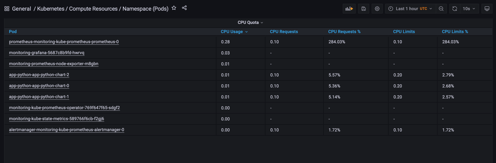
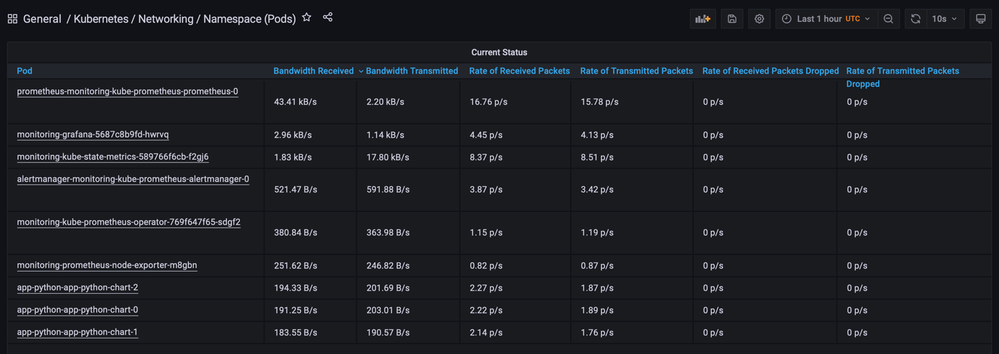

# Kube-Prometheus stack

Helm chart of the stack is available [here](https://github.com/prometheus-community/helm-charts/tree/main/charts/kube-prometheus-stack)

The stack itself is available [here](https://github.com/prometheus-operator/kube-prometheus)

## Stack components

- The [Prometheus Operator](https://github.com/prometheus-operator/prometheus-operator)

  The operator is like a "plugin" that automates prometheus deployment inside Kubernetes

- Highly available [Prometheus](https://prometheus.io/)

  Prometheus is a time-series DB that is used to store any TS data. Usually some metrics.

- Highly available [Alertmanager](https://github.com/prometheus/alertmanager)

  Alertmanager groups and routes active alerts to correct receiver.

- [Prometheus node-exporter](https://github.com/prometheus/node_exporter)

  Node exporter just collects metrics from hosts and publish it in prometheus format

- [Prometheus Adapter for Kubernetes Metrics APIs](https://github.com/DirectXMan12/k8s-prometheus-adapter)

  The name stands for itself: the adapter collects K8s metrics and publish it in prometheus format

- [kube-state-metrics](https://github.com/kubernetes/kube-state-metrics)

  Used to export metrics regarding each type of K8s component. I.e: deployments, nodes, pods, statefulSets

- [Grafana](https://grafana.com/)

  A visualisation tool

## Installing the helm chart

```bash
❯ helm repo add prometheus-community https://prometheus-community.github.io/helm-charts
"prometheus-community" has been added to your repositories

❯ helm repo update
Hang tight while we grab the latest from your chart repositories...
...Successfully got an update from the "prometheus-community" chart repository
Update Complete. ⎈Happy Helming!⎈

❯ helm install monitoring prometheus-community/kube-prometheus-stack

❯ kubectl get po,sts,svc,pvc,cm
NAME                                                         READY   STATUS    RESTARTS   AGE
pod/alertmanager-monitoring-kube-prometheus-alertmanager-0   2/2     Running   0          15m
pod/app-python-app-python-chart-0                            1/1     Running   0          6h54m
pod/app-python-app-python-chart-1                            1/1     Running   0          6h54m
pod/app-python-app-python-chart-2                            1/1     Running   0          6h54m
pod/monitoring-grafana-5687c8b9fd-hwrvq                      2/2     Running   0          15m
pod/monitoring-kube-prometheus-operator-769f647f65-sdgf2     1/1     Running   0          15m
pod/monitoring-kube-state-metrics-589766f6cb-f2gj6           1/1     Running   0          15m
pod/monitoring-prometheus-node-exporter-m8gbn                1/1     Running   0          15m
pod/prometheus-monitoring-kube-prometheus-prometheus-0       2/2     Running   0          15m

NAME                                                                    READY   AGE
statefulset.apps/alertmanager-monitoring-kube-prometheus-alertmanager   1/1     15m
statefulset.apps/app-python-app-python-chart                            3/3     6h55m
statefulset.apps/prometheus-monitoring-kube-prometheus-prometheus       1/1     15m

NAME                                              TYPE           CLUSTER-IP       EXTERNAL-IP   PORT(S)                      AGE
service/alertmanager-operated                     ClusterIP      None             <none>        9093/TCP,9094/TCP,9094/UDP   15m
service/app-python-app-python-chart               LoadBalancer   10.96.144.33     127.0.0.1     8000:30567/TCP               6h55m
service/kubernetes                                ClusterIP      10.96.0.1        <none>        443/TCP                      17d
service/monitoring-grafana                        ClusterIP      10.98.116.184    <none>        80/TCP                       15m
service/monitoring-kube-prometheus-alertmanager   ClusterIP      10.98.57.234     <none>        9093/TCP                     15m
service/monitoring-kube-prometheus-operator       ClusterIP      10.105.69.129    <none>        443/TCP                      15m
service/monitoring-kube-prometheus-prometheus     ClusterIP      10.101.35.242    <none>        9090/TCP                     15m
service/monitoring-kube-state-metrics             ClusterIP      10.107.250.129   <none>        8080/TCP                     15m
service/monitoring-prometheus-node-exporter       ClusterIP      10.99.208.150    <none>        9100/TCP                     15m
service/prometheus-operated                       ClusterIP      None             <none>        9090/TCP                     15m

NAME                                                         STATUS   VOLUME                                     CAPACITY   ACCESS MODES   STORAGECLASS   AGE
persistentvolumeclaim/visits-app-python-app-python-chart-0   Bound    pvc-9b7361a0-d423-431d-a651-d44882dbe1cb   256M       RWO            standard       7h55m
persistentvolumeclaim/visits-app-python-app-python-chart-1   Bound    pvc-3dc38a46-51d2-4b74-aa64-1048636ef03d   256M       RWO            standard       7h54m
persistentvolumeclaim/visits-app-python-app-python-chart-2   Bound    pvc-16b8d1ec-d0cf-430d-885d-e8b14699fc93   256M       RWO            standard       7h54m

NAME                                                                     DATA   AGE
configmap/app-python-app-python-chart                                    1      6h55m
configmap/kube-root-ca.crt                                               1      17d
configmap/monitoring-grafana                                             1      15m
configmap/monitoring-grafana-config-dashboards                           1      15m
configmap/monitoring-grafana-test                                        1      15m
configmap/monitoring-kube-prometheus-alertmanager-overview               1      15m
configmap/monitoring-kube-prometheus-apiserver                           1      15m
configmap/monitoring-kube-prometheus-cluster-total                       1      15m
configmap/monitoring-kube-prometheus-controller-manager                  1      15m
configmap/monitoring-kube-prometheus-etcd                                1      15m
configmap/monitoring-kube-prometheus-grafana-datasource                  1      15m
configmap/monitoring-kube-prometheus-k8s-coredns                         1      15m
configmap/monitoring-kube-prometheus-k8s-resources-cluster               1      15m
configmap/monitoring-kube-prometheus-k8s-resources-namespace             1      15m
configmap/monitoring-kube-prometheus-k8s-resources-node                  1      15m
configmap/monitoring-kube-prometheus-k8s-resources-pod                   1      15m
configmap/monitoring-kube-prometheus-k8s-resources-workload              1      15m
configmap/monitoring-kube-prometheus-k8s-resources-workloads-namespace   1      15m
configmap/monitoring-kube-prometheus-kubelet                             1      15m
configmap/monitoring-kube-prometheus-namespace-by-pod                    1      15m
configmap/monitoring-kube-prometheus-namespace-by-workload               1      15m
configmap/monitoring-kube-prometheus-node-cluster-rsrc-use               1      15m
configmap/monitoring-kube-prometheus-node-rsrc-use                       1      15m
configmap/monitoring-kube-prometheus-nodes                               1      15m
configmap/monitoring-kube-prometheus-persistentvolumesusage              1      15m
configmap/monitoring-kube-prometheus-pod-total                           1      15m
configmap/monitoring-kube-prometheus-prometheus                          1      15m
configmap/monitoring-kube-prometheus-proxy                               1      15m
configmap/monitoring-kube-prometheus-scheduler                           1      15m
configmap/monitoring-kube-prometheus-statefulset                         1      15m
configmap/monitoring-kube-prometheus-workload-total                      1      15m
configmap/prometheus-monitoring-kube-prometheus-prometheus-rulefiles-0   28     15m
```

## Monitoring data

To access grafana from minikube use `minikube service monitoring-grafana`

At production cluster it might be necessary to forward a port: `kubectl port-forward <pod-name> 3000`
where `3000` is a port to forward

1. Check how much CPU and Memory your StatefulSet is consuming.

   My StatefulSet consumes: `0.0654 Gb ≈ 67 Mb` of memory and `≈ 1%` of CPU
   

1. Check which Pod is using CPU more than others and which is less in the default namespace.

   Prometheus pod (`prometheus-monitoring-kube-prometheus-prometheus-0`) consumes the most cpu: `0.28`;

   Pods consuming almost no CPU are:

   - AlertManager (`alertmanager-monitoring-kube-prometheus-alertmanager-0`)
   - Kube state metrics (`monitoring-kube-state-metrics-589766f6cb-f2gj6`)
   - Prometheus Operator (`monitoring-kube-prometheus-operator-769f647f65-sdgf2`)

   

1. Check how much memory is used on your node, in % and mb.

   Since I am using Mac, the minikube is installed inside a virtual machine with the following configuration:
   

   As a result, node-exporter reports data about that virtual machine instead of my host.

   Node memory consumption is `1.39 Gb` of application data, `12.9 Mb` of buffers, `473 Mb` of caches;
   `≈78.6%` of total memory
   

1. Check how many pods and containers actually ran by the Kubelet service.

   There are `18` pods and `34` containers.
   

1. Check which Pod is using network more than others and which is less in the default namespace.

   The least network usage is of my app pod (application pods only respond to healthcheck):

   - `app-python-app-python-chart-0`

   The greatest usage is by Prometheus due to metric scrapping:

   - `prometheus-monitoring-kube-prometheus-prometheus-0`

   

1. Check how many alerts you have. Also you can see them in the Web UI by the minikube
   service monitoring-kube-prometheus-alertmanager command.

   AlertManager reports having 8 alerts.
   

## initContainers

Init containers are run before main containers in OrderedReady fashion.

I used wget example from the [k8s initContainers documentation](https://kubernetes.io/docs/tasks/configure-pod-container/configure-pod-initialization/).
The downloaded file is mounted to a path set in `Values.volumes.preDownload`

```html
❯ kubectl exec pod/app-python-app-python-chart-0 -- cat /home/moscow_clock/preDownload/index.html
Defaulted container "app-python-chart" out of: app-python-chart, pre-download (init)
<html><head></head><body><header>
<title>http://info.cern.ch</title>
</header>

<h1>http://info.cern.ch - home of the first website</h1>
<p>From here you can:</p>
<ul>
<li><a href="http://info.cern.ch/hypertext/WWW/TheProject.html">Browse the first website</a></li>
<li><a href="http://line-mode.cern.ch/www/hypertext/WWW/TheProject.html">Browse the first website using the line-mode browser simulator</a></li>
<li><a href="http://home.web.cern.ch/topics/birth-web">Learn about the birth of the web</a></li>
<li><a href="http://home.web.cern.ch/about">Learn about CERN, the physics laboratory where the web was born</a></li>
</ul>
</body></html>
```
