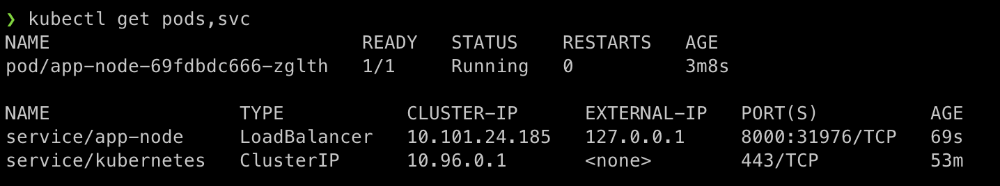
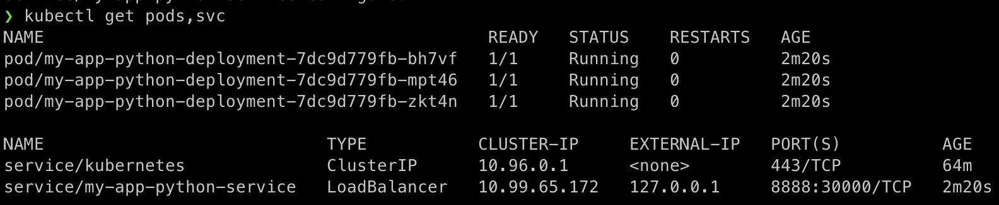

# Kubernetes

## Manual deployment

Here I show steps for manual deployment of the app with corresponding outputs

```bash
❯ kubectl create deployment app-node --image=winnerokay/app_python:latest
deployment.apps/app-node created

❯ kubectl get deployments
NAME       READY   UP-TO-DATE   AVAILABLE   AGE
app-node   1/1     1            1           10s

❯ kubectl get pods
NAME                        READY   STATUS    RESTARTS   AGE
app-node-69fdbdc666-zglth   1/1     Running   0          24s

# RUN in separate terminal "minikube tunnel", otherwise service will not have external IP
# source: https://minikube.sigs.k8s.io/docs/handbook/accessing/#loadbalancer-access

❯ kubectl expose deployment app-node --type=LoadBalancer --port=8000
service/app-node exposed

# minikube tunnel terminal will show now
🏃  Starting tunnel for service app-node.

❯ kubectl get services
NAME         TYPE           CLUSTER-IP      EXTERNAL-IP   PORT(S)          AGE
app-node     LoadBalancer   10.101.24.185   127.0.0.1     8000:31976/TCP   11s
kubernetes   ClusterIP      10.96.0.1       <none>        443/TCP          52m

❯ kubectl get pods,svc
NAME                            READY   STATUS    RESTARTS   AGE
pod/app-node-69fdbdc666-zglth   1/1     Running   0          3m8s

NAME                 TYPE           CLUSTER-IP      EXTERNAL-IP   PORT(S)          AGE
service/app-node     LoadBalancer   10.101.24.185   127.0.0.1     8000:31976/TCP   69s
service/kubernetes   ClusterIP      10.96.0.1       <none>        443/TCP          53m
```



**_Note on why "External-IP" is just 127.0.0.1:_**
by default minikube is installed with docker backend:

```
❯ docker ps
CONTAINER ID   IMAGE                                 COMMAND                  CREATED             STATUS             PORTS                                                                                                                                  NAMES
6a24702eea65   gcr.io/k8s-minikube/kicbase:v0.0.26   "/usr/local/bin/entr…"   About an hour ago   Up About an hour   127.0.0.1:64345->22/tcp, 127.0.0.1:64346->2376/tcp, 127.0.0.1:64348->5000/tcp, 127.0.0.1:64349->8443/tcp, 127.0.0.1:64347->32443/tcp   minikube
```

Since I used MacOS host to perform the lab, the docker in running inside a docker VM,
so external IP is just a ssh tunnel which is justified by `lsof` output:

```
❯ sudo lsof -nP -i4TCP:8000 | grep LISTEN
ssh     30383 d-manakovskiy    5u  IPv4 0x4d4ab91dfa9f5133      0t0  TCP 127.0.0.1:8000 (LISTEN)
```

Cleanup:

```bash
❯ kubectl delete deployment app-node
deployment.apps "app-node" deleted

❯ kubectl delete service app-node
service "app-node" deleted
```

## Automatized deployment

```
# RUN in separate terminal "minikube tunnel", otherwise service will not have external IP
# source: https://minikube.sigs.k8s.io/docs/handbook/accessing/#loadbalancer-access

❯ kubectl apply -f ./
deployment.apps/my-app-python-deployment created
service/my-app-python-service created

# minikube tunnel terminal will show now
🏃  Starting tunnel for service my-app-python-service.

❯ kubectl get pods,svc
NAME                                            READY   STATUS    RESTARTS   AGE
pod/my-app-python-deployment-7dc9d779fb-bh7vf   1/1     Running   0          2m20s
pod/my-app-python-deployment-7dc9d779fb-mpt46   1/1     Running   0          2m20s
pod/my-app-python-deployment-7dc9d779fb-zkt4n   1/1     Running   0          2m20s

NAME                            TYPE           CLUSTER-IP     EXTERNAL-IP   PORT(S)          AGE
service/kubernetes              ClusterIP      10.96.0.1      <none>        443/TCP          64m
service/my-app-python-service   LoadBalancer   10.99.65.172   127.0.0.1     8888:30000/TCP   2m20s
```


