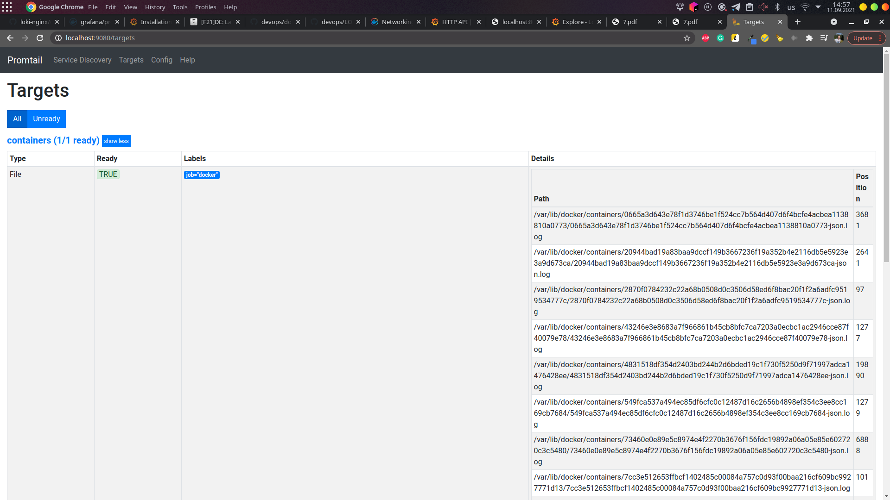
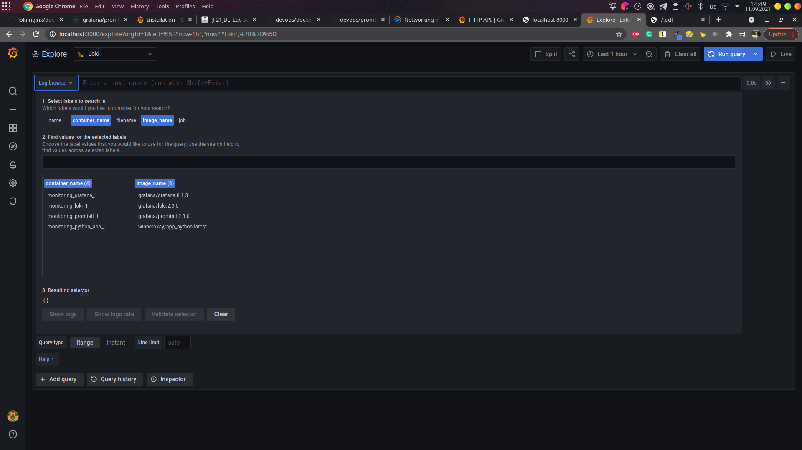
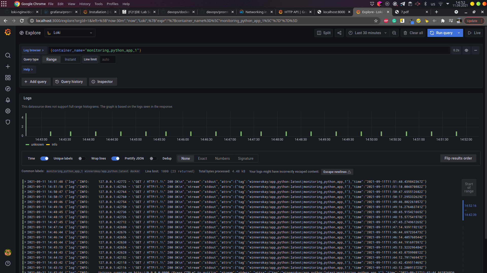
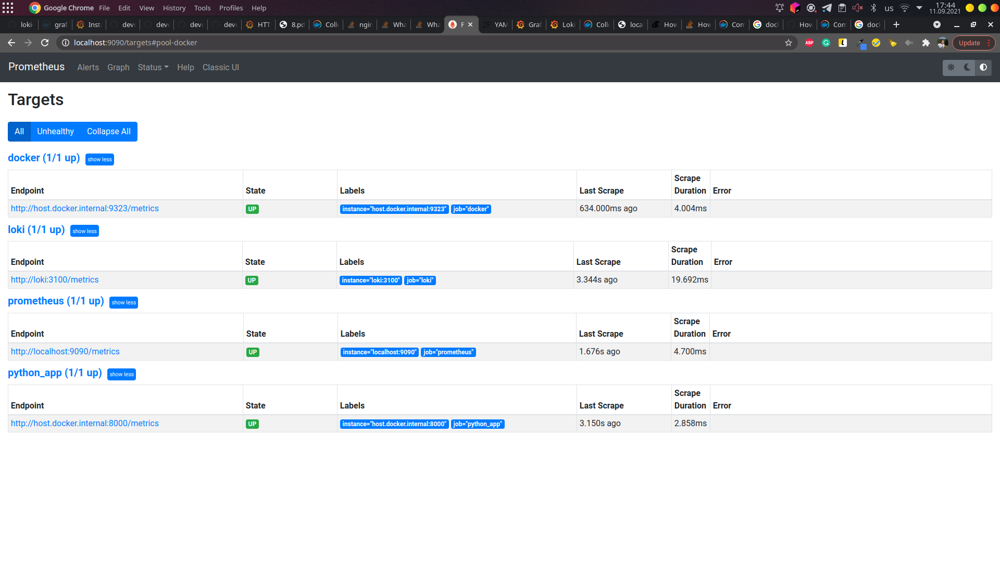
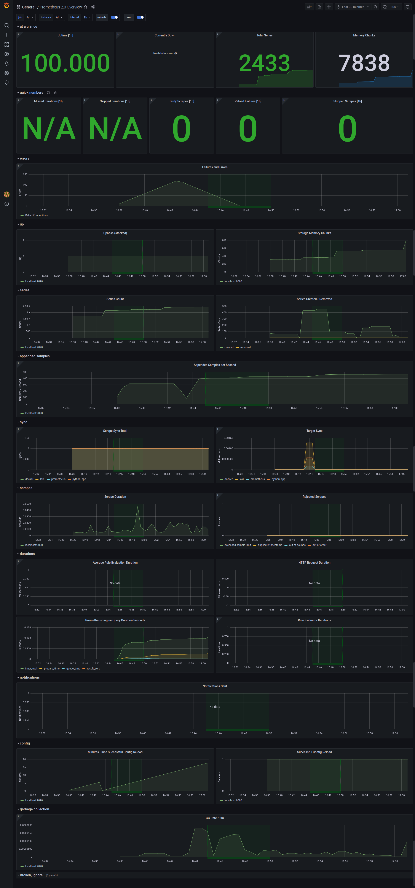
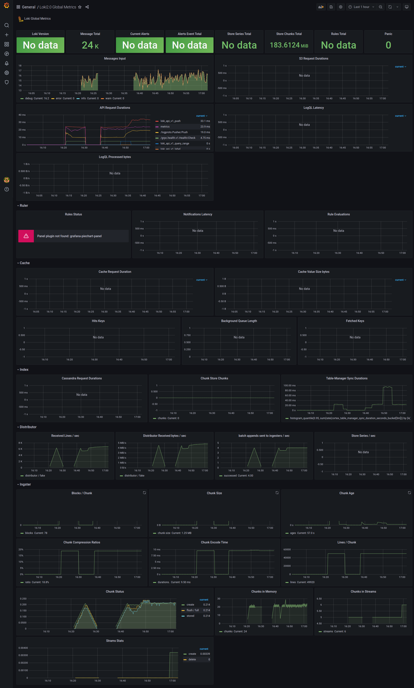
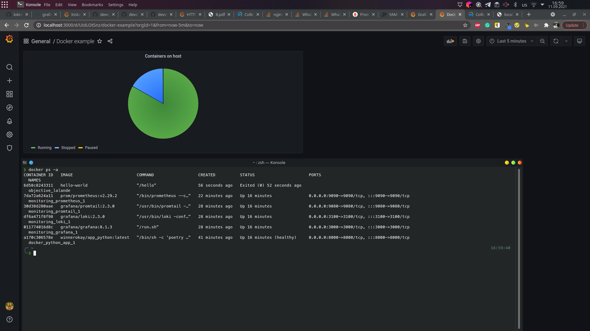
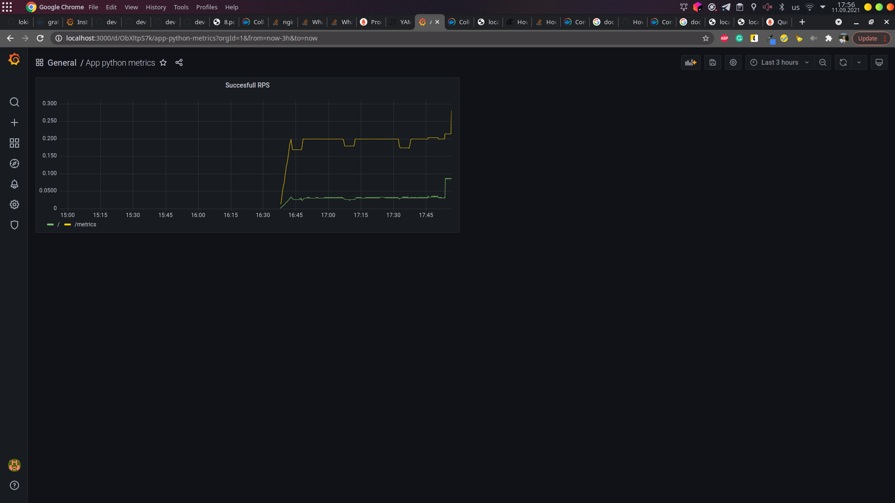

# Logging

## Best practices

- Perform log rotation. It can be done on docker-level ([logging](https://docs.docker.com/config/containers/logging/configure/) option) or application level
  (for python there is a [RotatingFileHandler](https://docs.python.org/3/library/logging.handlers.html#rotatingfilehandler)
  in default `logging` library)

- Use common log format for applications to simplify further log parsing and searching

- Backup long-term logs in external storage. I.e: S3 bucket.

- Make sure you never compromise sensitive data in logs.

## Screenshots

Promtail targets set up:


Container discovery at explorer:


Logs from python application:


# Metrics

## Notes

Docker has an experimental feature to export metrics in prometheus
compatible metrics.

To enable the feature follow steps from the [official documentation](https://docs.docker.com/config/daemon/prometheus/).
`Note:` to be able to access metrics from inside docker specify the docker network interface
as the interface on which docker will serve metrics. For me it is the following:

```bash
> ip address show | grep docker
5: docker0: <NO-CARRIER,BROADCAST,MULTICAST,UP> mtu 1500 qdisc noqueue state DOWN group default 
    inet 172.17.0.1/16 brd 172.17.255.255 scope global docker0
```

You also should allow prometheus container make requests to host by adding an `extra_host`

## Screenshots

Prometheus targets


Dashboards:

- Prometheus
  

- Loki
  

- Docker.
  I did not find any working existing dashboard
  since the feature is still experimental.
  Therefore, I just rendered amount of containers
  

- My python app. Same as with docker:
  there is no good dashboard for metric exporter that I used
  ([prometheus-fastapi-instrumentator](https://github.com/trallnag/prometheus-fastapi-instrumentator)),
  so I just rendered the amount of succesfull requests per second for each endpoint
  
